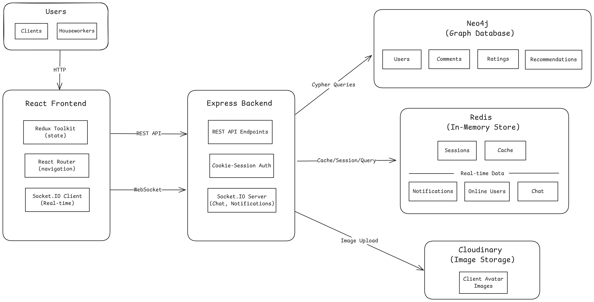

# System Architecture

## Table of Contents
- [Overview](#overview)
- [Architecture Design](#architecture-design)
  - [System Architecture Diagram](#system-architecture-diagram)
  - [Component Overview](#component-overview)
  - [Technology Stack](#technology-stack)
- [High-Level Data Flows](#high-level-data-flows)
  - [User Authentication Flow](#1-user-authentication-flow)
  - [Real-Time Chat Flow](#2-real-time-chat-flow)
  - [Houseworker Recommendation Flow](#3-houseworker-recommendation-flow)
  - [Filtering with Cache Flow](#4-filtering-with-cache-flow)
  - [Rating & Notification Flow](#5-rating--notification-flow)
  - [Room Management Flow](#6-room-management-flow)
- [Architecture Decisions (ADR)](#architecture-decisions-adr)

## Overview

HomeAssistant is a **full-stack real-time web application** that connects clients with house workers for professional services. The architecture is designed to handle:

- **Complex relationship queries** for relations like 'comments', rating and users data manipulations (Neo4j)
- **High-performance caching** for fast filtering (cache recent filtered users) (Redis)
- **Real-time bidirectional communication** for chat and notifications (Socket.IO)
- **Secure session-based authentication** (Cookie-based sessions in Redis)

## Architecture Design

### System Architecture Diagram

### Component Overview

#### **Frontend Layer (React + Redux Toolkit)**

- **Responsibilities:**
  - User interface rendering and interactions
  - Centralized state management with Redux Toolkit
  - Client-side routing with React Router
  - Real-time UI updates via Socket.IO client
  - Form validation and error handling

- **Key Features:**
  - Responsive design with SCSS
  - Real-time chat interface
  - Houseworker filtering and search
  - Users Comments and ratings

<!-- 
 -->

#### **Backend Layer (Express + Socket.IO)**

- **Responsibilities:**
  - RESTful API endpoints for CRUD operations
  - Cookie-based session authentication and authorization
  - Business logic (filtering, recommendations, validation)
  - WebSocket event handling for real-time features
  - Integration with databases and external services

- **Key Features:**
  - Session management with Redis
  - Input validation and sanitization
  - Error handling and logging
  - Real-time event broadcasting
  - CORS configuration

<!-- 
 -->

#### **Data Layer**

**Neo4j (Primary Database)**
- Stores user profiles, comments, ratings 
- Graph relationships for recommendation engine
- Efficient relationship traversal queries //Reform
- Indexed on email, profession, location //CHECK

**Redis (Cache & Real-time)**
- Session storage for authentication
- Query result caching (filtered users)
- Chat related Data (rooms, messages) //FF
- Notiifcations persist Data // FF
- Online user tracking
- Typing indicators and room activity
- TTL-based automatic expiration

#### **External Services**

**Cloudinary**
- User avatar image uploads
- Image optimization and transformation
- CDN for fast global delivery

<!-- 
 -->

### Technology Stack

| Layer | Technology | Version | Purpose |
|-------|-----------|---------|---------|
| **Frontend** | React | 18.x | UI framework |
| | React Redux | 8.x | State management |
| | React Router | 6.x | Client-side routing |
| | Socket.IO Client | 4.8.x | WebSocket client |
| | SCSS | - | Styling |
| **Backend** | Node.js | 22.x | Runtime environment |
| | Express | 4.16.x | Web framework |
| | Socket.IO | 4.8.x | WebSocket server |
| **Databases** | Neo4j | 5.x | Graph database |
| | Redis | 6.1.x | In-memory store |
| **External** | Cloudinary | - | Image storage/CDN |

---

## High-Level Data Flows

### 1. User Authentication Flow

### 2. Real-time Chat Flow

### 3. Filtering with Cache Flow

### 4. Notification Flow

### 5. Room Management Flow

## Architecture Decisions (ADR)

### 1. Why Neo4j for Primary Database?

**Context:**
The aplication requires relatations between client, houseworkers, comments, ratings. The recommendation based  relations between client and their interests, location

**Decision:**
Use Neo4j as the primary database for all users data, comments, and ratings.

**Alternatives Considered:**

| Database | Pros | Cons | Why Rejected |
|----------|------|------|--------------|
| PostgreSQL | Mature, strong consistency, familiar SQL | Complex JOINs for recommendations (3-4 tables), slow graph traversal | Poor performance for relationship queries |
| MongoDB | Flexible schema, popular | Not optimized for relationships, would require multiple queries + app-level joins | No native graph queries |
| MySQL | Well-known, widely used | Similar to PostgreSQL - expensive JOINs | Same performance issues as PostgreSQL |

**Rationale:**
- **Native Graph Queries:** Cypher query language is designer for relationship traversal, making recommendation queries intuitive and performant
- **No JOIN Overhead:** Relationships are first-class citizens, eliminating expensive JOIN operations
- **Performance:** Graph queries run in ~50-100ms vs. 300-500ms with relational JOINs (3x faster)
- **Scalability:** Graph structure scales better as relationships grow
- **Inutitive Modeling:** Social connections and recommendations naturally map to graph structure (good fit for systems that have 'social network' relations as 'comments', 'ratings', 'likes')

**Consequences:**
- **Positive:**
   - Efficent recommendation engine
   - Simple, redable Cypher queries
   - Natural data model for relationships
   - good performance at scale (when relations grow)

- **Negative**
   - A bit harder learning curve for team member unfamiliar with graph databases
   - Smaller ecosystem compared to more 'known' databases as PostgreSQL/MySQL
   - Fewer ORM's and tool available

### 2. Why Redis for Caching, Sessions and Chat?

## Performance Optimizations

