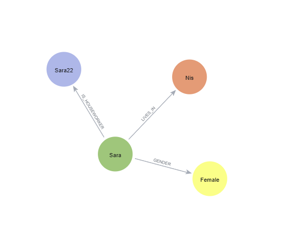
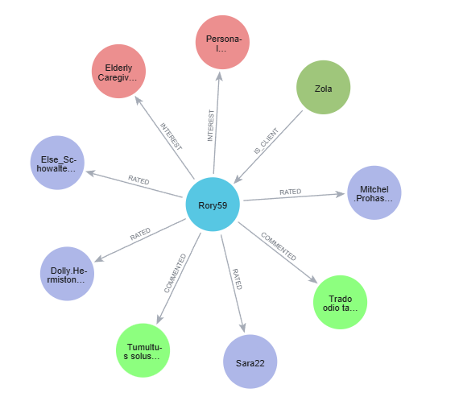
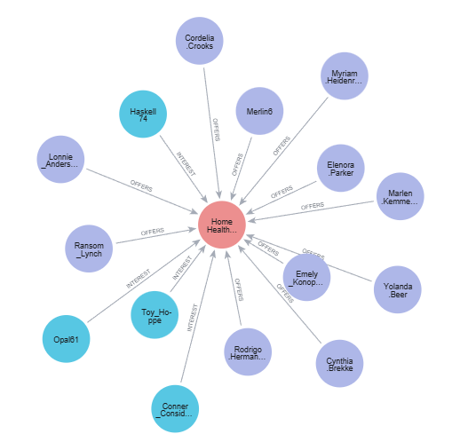
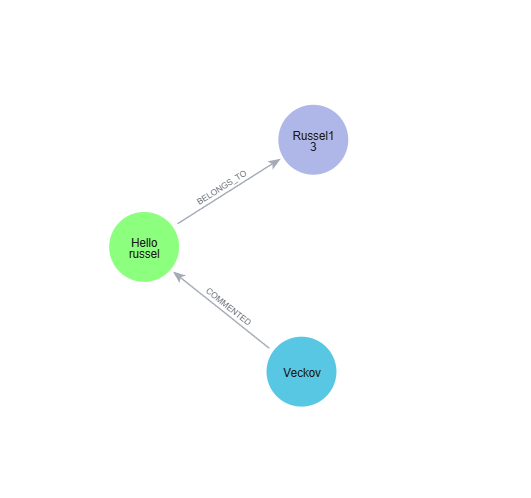
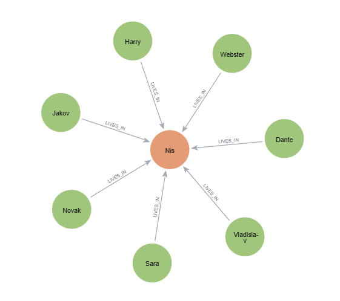
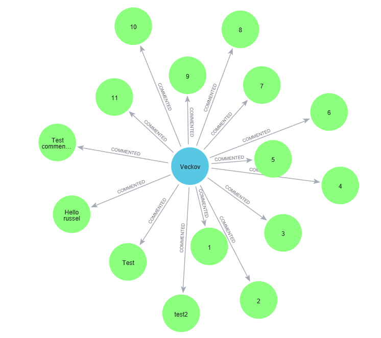
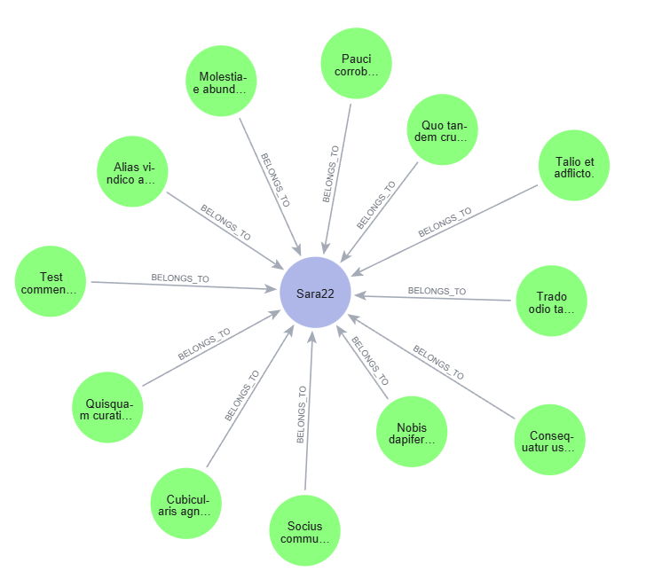

# Date Model Design

## Table of Contents
- [Overview](#overview)
- [Neo4j Graph Database](#neo4j-graph-database)
  - [Node Types](#node-types)
  - [Relationship Types](#relationship-types)
  - [Graph Schema Diagram](#graph-schema-diagram)
  - [Cypher Query Examples](#cypher-query-examples)
  - [Indexing Strategy](#indexing-strategy)
- [Redis In-Memory Store](#redis-in-memory-store)
  - [Key Naming Conventions](#key-naming-conventions)
  - [Data Structures Overview](#data-Structures-overview)
  - [User Management](#user-management)
  - [Session Management](#session-management)
  - [Caching Strategy](#caching-strategy)
  - [Chat & Room Management](#chat--room-management)
  - [Notifications System](#notifications-system)

## Overview

HomeAssistant uses a **hybrid database architecture** combining Neo4j and Redis to leverage the unique strengths of each:

- **Neo4j (Graph Database)**: Persistent storage for user profiles, relationships, ratings, comments, and recommendation

- **Redis (In-Memory Store)**: High-performance caching, session management, real-time chat, room management, and notifications


## Neo4j Graph Database

Neo4j was choose for its ability to efficiently handle **relationship-based queries** wihtout expensive JOIN operations.


### Node Types

#### 1. User (Base Node)

Every user in the system has this base label, then an additional relationship indicates their type (Client or Houseworker).

**Label:** `User`

**Properties:**
```javascript
{
  id: String (UUID),
  email: String (unique, indexed),
  username: String (unique, indexed),
  password: String (bcrypt hashed),
  firstName: String,
  lastName: String,
  picturePath: String (Cloudinary URL),
  picturePublicId: String (Cloudinary PUBLIC_ID)
}
```


**Relations:** `IS_CLIENT`, `IS_HOUSEWORKER`, `LIVES_IN`, `GENDER`

**Relationships:**
- `(User)-[:IS_CLIENT]->(Client)`
- `(User)-[:IS_HOUSEWORKER]->(HouseWorker)`
- `(User)-[:GENDER]->(Gender)`
- `(User)-[:LIVES_IN]->(City)`

**User example node**



#### 2. Client (Relation with User Node)
Represents clients who search for and hire houseworkers.
- **Label:** `Client`


<!-- !!!! This should be in another topics 
Username is also stored in USER node, the username cannot be updated so there can be no problem with consistency between  the 'username' in the User and Client/Houseworker Nodes 
 -->
**Properties:**
```javascript
{
  username: String (unique, indexed), //prenset in User node as well
}
```

**Relations:** `IS_CLIENT`, `INTERESTS`, `RATED`, `COMMENTED`

**Relationships:**
- `(Client)-[:INTEREST]->(Profession)` - Client's profession interests
- `(Client)-[:COMMENTED]->(Comment)` - Comments posted by client
- `(Client)-[:RATED]->(HouseWorker)` - Ratings given by client




#### 3. Houseworker (Relation with User Node)
Represents houseworkers who offer services.
**Label:** `Houseworker`

**Properties:**
```javascript
{
  username: String,         // Reference to User node
  address: String,          // Physical address
  description: String,      // Bio/description of services
  phone_number: String,     // Contact phone number
  age: Integer             // Age of houseworker
}
```

**Relations:** `IS_HOUSEWORKER`, `OFFERS`, `BELLONGS_TO`, 
`COMMENTED`

**Relationships:**
- `(HouseWorker)-[:OFFERS {working_hour: String}]->(Profession)` - Services offered
- `(HouseWorker)<-[:BELONGS_TO]-(Comment)` - Comments received
- `(HouseWorker)<-[:RATED {rating: Integer}]-(Client)` - Ratings received


#### 4. Profession
Pre-created profession nodes representing services.

**Label:** `Profession`

**Properties:**
```javascript
{
  title: String,       // e.g., "Housekeeper", "Nanny", "Personal Chef"
  description: String  // Detailed description of the profession
}
```
**Relations:** `OFFERS`, `INTEREST`

**Relationships:**
- `(HouseWorker)-[:OFFERS {working_hour: String}]->(Profession)`
- `(Client)-[:INTEREST]->(Profession)`

**Pre-created Professions:**
- Housekeeper
- Nanny
- Personal Chef
- Gardener
- Personal Driver
- Elderly Caregiver
- Pet Sitter
- Home Health Aide
- Personal Shopper
- Butler




#### 5. Comment
User comments/reviews on houseworkers.

**Label:** `Comment`

**Properties:**
```javascript
{
  context: String,    // Comment text content
  read: Boolean,      // Whether houseworker has read the comment
  timestamp: Long     // Unix timestamp in milliseconds
}
```

**Relations:** `COMMENTED`, `BELONGS_TO` 

**Relationships:**
- `(Client)-[:COMMENTED]->(Comment)`
- `(Comment)-[:BELONGS_TO]->(HouseWorker)`




#### 6. Gender
Pre-created gender nodes for filtering.

**Label:** `Gender`

**Properties:**
```javascript
{
  type: String  // "Male", "Female"
}
```

**Created at initialization:**
```cypher
CREATE (n:Gender {type:"Male"})
CREATE (n:Gender {type:"Female"})
```

#### 7. City
Location nodes created dynamically as users register.

**Label:** `City`

**Properties:**
```javascript
{
  name: String  // City name (indexed)
}
```

**Created with MERGE:**
```cypher
MERGE (c:City {name: $cityName})
```


### Relationship Types

#### 1. IS_CLIENT
**Pattern:** `(User)-[:IS_CLIENT]->(Client)`

**Purpose:** Identifies a user as a client

**Properties:** None


#### 2. IS_HOUSEWORKER
**Pattern:** `(User)-[:IS_HOUSEWORKER]->(HouseWorker)`

**Purpose:** Identifies a user as a houseworker

**Properties:** None

#### 3. GENDER
**Pattern:** `(User)-[:GENDER]->(Gender)`

**Purpose:** Links user to their gender for filtering

**Properties:** None


#### 4. LIVES_IN
**Pattern:** `(User)-[:LIVES_IN]->(City)`

**Purpose:** Links user to their city for location-based filtering

**Properties:** None




#### 5. INTEREST
**Pattern:** `(Client)-[:INTEREST]->(Profession)`

**Purpose:** Tracks client interests for recommendation engine

**Properties:** None

**Example:** Limit 20 Interest Relationships 


**Usage:** 
```cypher
// Add interest
MATCH (c:Client {username: $client})
MATCH (p:Profession {title: $profession})
MERGE (c)-[:INTEREST]->(p)
LIMIT 10
```


#### 6. OFFERS
**Pattern:** `(HouseWorker)-[:OFFERS {working_hour: String}]->(Profession)`

**Purpose:** Links houseworker to professions they offer

**Properties:**
```javascript
{
  working_hour: String  // e.g., "Full-time", "Part-time", "Weekends"
}
```
**Example:** Limit 10 Offers Relationships 


**Usage:**
```cypher
// Add profession to houseworker
MATCH (hw:HouseWorker {username: $houseworker})
MATCH (p:Profession {title: $profession})
MERGE (hw)-[r:OFFERS {working_hour: $hour}]->(p)
```


#### 7. RATED
**Pattern:** `(Client)-[:RATED {rating: Integer}]->(HouseWorker)`

**Purpose:** Store ratings given by clients

**Properties:**
```javascript
{
  rating: Integer  // 1-5 star rating
}
```

**Example:** Limit 7 Rated Relationships 


**Usage:**
```cypher
// Rate houseworker (MERGE to update existing rating)
MATCH (c:Client {username: $client})
MATCH (hw:HouseWorker {username: $houseworker})
MERGE (c)-[r:RATED]->(hw)
ON CREATE SET r.rating = $rating
ON MATCH SET r.rating = $rating
```


#### 8. COMMENTED
**Pattern:** `(Client)-[:COMMENTED]->(Comment)`

**Purpose:** Links client to their posted comments

**Properties:** None

**Example:** Client `Veckov's` 15 Posted comments



#### 9. BELONGS_TO
**Pattern:** `(Comment)-[:BELONGS_TO]->(HouseWorker)`

**Purpose:** Links comment to the houseworker being reviewed

**Properties:** None

**Example:** Comments belongs to `Sara22` Houseworker 



### Graph Schema Diagram

### Cypher Query Examples

### Indexing Strategy

```cypher
// User username (most frequent lookup)
CREATE INDEX user_username_index IF NOT EXISTS 
FOR (u:User) ON (u.username)

// Client username
CREATE INDEX client_username_index IF NOT EXISTS 
FOR (c:Client) ON (c.username)

// Houseworker username
CREATE INDEX houseworker_username_index IF NOT EXISTS 
FOR (h:HouseWorker) ON (h.username)

// City name (location-based filtering)
CREATE INDEX city_name_index IF NOT EXISTS 
FOR (c:City) ON (c.name)

// Gender type (filtering)
CREATE INDEX gender_type_index IF NOT EXISTS 
FOR (g:Gender) ON (g.type)

// Comment timestamp (sorting by date)
CREATE INDEX comment_id_index IF NOT EXISTS 
FOR (c:Comment) ON (c.timestamp)
```

**Why These Indexes?**
- `username`: Primary lookup key in almost every query
- `city.name`: Geographic filtering is a core feature
- `gender.type`: Frequent filtering criteria
- `comment.timestamp`: Sorting comments by date

**Performance Impact:**
- Without indexes: 300-500ms for complex queries
- With indexes: 50-150ms for the same queries (~3-5x improvement)


---

<!-- REDIS -->

## Redis In-Memory Store

### Why Redis?

Redis provides **sub-millisecond response times** and specialized data structures for:
- Session management (Hash)
- Chat message storage (Sorted Set)
- Room management (Sorted Set)
- Notifications (Sorted Set)
- Query caching (Strings with TTL)
- Online user tracking (Sets)


---

### Key Naming Conventions

| Pattern | Purpose | Example |
|---------|---------|---------|
| `user:{userID}` | User profile data | `user:1` |
| `username:{username}` | Username → userID mapping | `username:john_doe` |
| `sess:{sessionID}` | Session data (express-session) | `sess:abc123...` |
| `room:{roomID}` | Chat messages | `room:1:2` |
| `user:{userID}:rooms` | User's room list | `user:1:rooms` |
| `user:{userID}:room:{roomID}:unread` | Unread message count | `user:1:room:1:2:unread` |
| `user:{userID}:notifications` | User notifications | `user:1:notifications` |
| `onlineUsers` | Set of online user IDs | `onlineUsers` |
| `recommended:{username}` | Cached recommendations | `recommended:john_doe` |
| `total_users` | Counter for user IDs | `total_users` |
| `notificationCount` | Counter for notification IDs | `notificationCount` |

**Naming Rules:**
- Use colons `:` to separate namespaces
- User-specific keys start with `user:{userID}`
- Counters use simple names without prefixes
- Cache keys use descriptive prefixes or JSON stringified filters

---

### Data Structures Overview

| Use Case | Data Structure | Key Pattern | TTL |
|----------|---------------|-------------|-----|
| User Info | Hash | `user:{userID}` | Permanent |
| Username→ID Mapping | String | `username:{username}` | Permanent |
| Sessions | Hash (via express-session) | `sess:{sessionID}` | 1 hour |
| Chat Messages | Sorted Set | `room:{roomID}` | Permanent |
| User Rooms | Sorted Set | `user:{userID}:rooms` | Permanent |
| Unread Messages | Hash | `user:{userID}:room:{roomID}:unread` | Permanent |
| Notifications | Sorted Set | `user:{userID}:notifications` | Permanent |
| Online Users | Set | `onlineUsers` | Permanent |
| Cached Filters | String (JSON) | JSON.stringify(filters) | 10 min |
| Cached Recommendations | String (JSON) | `recommended:{username}` | 10 min |

---


## User Management

#### User Data Structure (Hash)

**Key:** `user:{userID}`

**Fields:**
```javascript
{
  username: "john_doe",
  password: "bcrypt_hashed_password",
  picturePath: "https://cloudinary.com/...",
  picturePublicId: "homeassistant/abc123"
}
```

**Create User:**
```javascript
const freeID = await incr("total_users");
const userKey = `user:${freeID}`;

await set(`username:${username}`, userKey);
await hmset(userKey, [
  "username", username, 
  "password", hashedPassword, 
  "picturePath", picturePath, 
  "picturePublicId", picturePublicId
]);
```

**Get User ID by Username:**

**Get Username by User ID:**

**Update User Picture Path:**

---

### Session Management

**Managed by `express-session` + `connect-redis`**

**Key Pattern:** `sess:{sessionID}`

**Session Data:**
```javascript
{
  cookie: { 
    maxAge: 3600000,  // 1 hour
    httpOnly: true,
    secure: true (in production),
    sameSite: "none" (in production)
  },
  username: "john_doe",
  userType: "client" or "houseworker"
}
```

**Configuration:**
```javascript
session({
  store: new RedisStore({ client: redisClient }),
  resave: false, 
  saveUninitialized: false,
  name: "sessionLog",
  secret: process.env.SESSION_SECRET,
  cookie: {
    secure: process.env.NODE_ENV === "production",
    httpOnly: true,
    sameSite: process.env.NODE_ENV === "production" ? "none" : "lax",
    maxAge: 1000 * 60 * 60,  // 1 hour
  }
})
```

**TTL:** 1 hour (automatic expiration)

**Access Session in Socket.IO:**
```javascript
io.use(function(socket, next) {
  sessionMiddleware(socket.request, socket.request.res || {}, next);
});
```

---

### Caching Strategy

#### 1. Filtered Houseworkers Cache

**Key:** JSON.stringify(filters)

**Example Key:**
```javascript
'{"limit":10,"itemsPerPage":4,"pageNumber":1,"sort":"ASC","city":"New York","gender":"Male","ageFrom":"25","ageTo":"45","professions":"Housekeeper,Nanny"}'
```

**Value:** JSON stringified array of houseworker objects

**TTL:** 10 minutes (600 seconds)

**Implementation:**
```javascript
const checkFilterHouseworkerInCache = async (filters) => {
  const filter = JSON.stringify(filters);
  const data = await get(filter);
  
  if (data) {
    return JSON.parse(data);
  }
  return null;
}

// In findAllWithFilters:
const cachedData = await checkFilterHouseworkerInCache(filters);
if (cachedData == null) {
  // Query Neo4j
  const houseworkers = await session.run(query);
  
  // Store in cache
  await set(JSON.stringify(filters), JSON.stringify(houseworkers));
  await expire(JSON.stringify(filters), 10 * 60);
  
  return houseworkers;
} else {
  return cachedData;
}
```

**Why 10 minutes?**
- Houseworker data doesn't change frequently
- Balances freshness vs. performance
- Reduces Neo4j query load by ~75-80%

#### 2. Recommended Houseworkers Cache

**Key:** `recommended:{username}`

**Example:** `recommended:john_doe`

**Value:** JSON stringified array of recommended houseworkers

**TTL:** 10 minutes (600 seconds)

**Implementation:**
```javascript
const checkRecommendedInCache = async (username) => {
  const data = await get("recommended:" + username);
  if (data) {
    return JSON.parse(data);
  }
  return null;
}

const cachedData = await checkRecommendedInCache(username);
if (cachedData == null) {
  // Query Neo4j
  const houseworkers = await session.run(recommendationQuery);
  
  // Store in cache
  await set("recommended:" + username, JSON.stringify(houseworkers));
  await expire("recommended:" + username, 10 * 60);
  
  return houseworkers;
} else {
  return cachedData;
}
```

**Why 10 minutes?**
- Recommendations are expensive to compute (graph traversal)
- Client interests don't change frequently
- Provides good user experience with fresh-enough data

---

### Online Users Tracking

**Key:** `onlineUsers`

**Structure:** Set

**Example:**
```
onlineUsers (Set)
─────────────────
"1"
"2"
"5"
"12"
```

**Add User When Connected (Socket.IO):**
```javascript
socket.on('connection', async (socket) => {
  const userID = await getUserIdByUsername(socket.request.session.username);
  await sadd('onlineUsers', userID);
  
  // Broadcast to other users
  io.emit('user_online', { userID, username });
});
```

**Remove User When Disconnected:**
```javascript
socket.on('disconnect', async () => {
  const userID = await getUserIdByUsername(socket.request.session.username);
  await srem('onlineUsers', userID);
  
  // Broadcast to other users
  io.emit('user_offline', { userID });
});
```

**Check If User Is Online:**
```javascript
const isOnline = await sismember('onlineUsers', userID);
```

**Get All Online Users:**
```javascript
const onlineUsers = await smembers('onlineUsers');
```

---

### Chat & Room Management

#### Chat Messages (Sorted Set)

**Key:** `room:{roomID}`

**Structure:** Sorted Set with score = timestamp

**Example:**
```
room:1:2 (Sorted Set)
Score (timestamp)    Member (JSON string)
─────────────────    ────────────────────
1697808000000        '{"message":"Hi!","from":"1","date":"20.10.2024","roomID":"1:2"}'
1697808060000        '{"message":"Hello!","from":"2","date":"20.10.2024","roomID":"1:2"}'
1697808120000        '{"message":"How are you?","from":"1","date":"20.10.2024","roomID":"1:2"}'
```

**Send Message:**
```javascript
const sendMessage = async (messageObj) => {
  const { roomID, from, message } = messageObj;
  const timestamps = Date.now();
  const dateFormat = formatDate(new Date(timestamps));
  const newMessageObj = { ...messageObj, date: dateFormat };
  
  const roomKey = `room:${roomID}`;
  await zadd(roomKey, timestamps, JSON.stringify(newMessageObj));
  
  // Update room activity for all users
  const usersID = roomID.split(":");
  for (const id of usersID) {
    await zaddxx(`user:${id}:rooms`, timestamps, roomID);
  }
}
```

**Get Messages with Pagination:**
```javascript
const getMessages = async (roomID, offset, size) => {
  const roomKey = `room:${roomID}`;
  const messages = await zrangerev(roomKey, offset, size - 1);
  const messagesObj = messages.map((mes) => JSON.parse(mes));
  return messagesObj;
}
```

---

#### User Rooms (Sorted Set)

**Key:** `user:{userID}:rooms`

**Structure:** Sorted Set with score = last activity timestamp

**Example:**
```
user:1:rooms (Sorted Set)
Score (timestamp)    Member (roomID)
─────────────────    ───────────────
1697808120000        "1:2"
1697807000000        "1:3"
1697806000000        "1:2:3"
```

**Purpose:** 
- Track all rooms a user belongs to
- Sort rooms by recent activity (most recent first)

**Create Room:**
```javascript
const createRoom = async (clientUsername, houseworkerUsername) => {
  const clientID = await getUserIdByUsername(clientUsername);
  const houseworkerID = await getUserIdByUsername(houseworkerUsername);
  
  // Format: lower ID first
  const usersRoomID = getRoomIdInOrder(clientID, houseworkerID);
  
  const timestamps = Date.now();
  await zadd(`user:${clientID}:rooms`, timestamps, usersRoomID);
  await zadd(`user:${houseworkerID}:rooms`, timestamps, usersRoomID);
  
  return usersRoomID;
}
```

---

#### Room ID Format

**Pattern:** `{userID1}:{userID2}:{userID3}:...`

**Rules:**
- User IDs are **sorted numerically** (ascending)
- Private chat: `1:2` (2 users)
- Group chat: `1:2:3` (3+ users)

**Helper Function:**
```javascript
const getRoomIdInOrder = (firstUserID, secondUserID) => {
  const minUserID = firstUserID > secondUserID ? secondUserID : firstUserID;
  const maxUserID = firstUserID > secondUserID ? firstUserID : secondUserID;
  return `${minUserID}:${maxUserID}`;
}
```

**Get All User Rooms:**
```javascript
const getAllRooms = async (username) => {
  let userID = await getUserIdByUsername(username);
  let rooms = await zrangerev(`user:${userID}:rooms`, 0, -1);
  
  // For each room, get last message and participants
  // ... (see Chat.js for full implementation)
  
  return roomsObj;
}
```

---

#### Unread Messages (Hash)

**Key:** `user:{userID}:room:{roomID}:unread`

**Fields:**
```javascript
{
  count: "3",          // Number of unread messages
  sender: "2"          // Sender's userID
}
```

**Increment Unread Count:**
```javascript
const postUnreadMessagesToUser = async (roomID, senderUserID) => {
  const userIDFromRoom = roomID.split(":").filter(id => id != senderUserID);
  
  userIDFromRoom.forEach(async (id) => {
    const unreadMessKey = `user:${id}:room:${roomID}:unread`;
    let countNumber = await getUnreadMessageCountByRoomID(id, roomID) || 0;
    countNumber += 1;
    
    await hmset(unreadMessKey, ["count", countNumber, "sender", senderUserID]);
  });
}
```

**Reset Unread Count:**
```javascript
const resetUnreadMessagesCount = async (roomID, userID) => {
  const unreadMessKey = `user:${userID}:room:${roomID}:unread`;
  await del(unreadMessKey);
}
```

#### Group Chat Operations

**Add User to Room:**
```javascript
const addUserToRoom = async (clientID, newUsername, currentRoomID) => {
  const newUserID = await getUserIdByUsername(newUsername);
  const currentUserIDS = currentRoomID.split(':');
  
  currentUserIDS.push(newUserID);
  currentUserIDS.sort((a, b) => a - b);
  
  const newRoomID = currentUserIDS.join(":");
  const newRoomKey = `room:${newRoomID}`;
  
  const timestamps = Date.now();
  
  // If private chat (2 users), create new room
  if (currentUserIDS.length === 3) {
    for (const id of currentUserIDS) {
      await zadd(`user:${id}:rooms`, timestamps, newRoomID);
    }
    
    const messageObj = JSON.stringify({
      message: "Chat Created", 
      from: 'Server', 
      date: dateFormat, 
      roomID: newRoomID
    });
    await zadd(newRoomKey, timestamps, messageObj);
  }
  // If group chat, rename existing room
  else {
    await rename(`room:${currentRoomID}`, newRoomKey);
    await zadd(`user:${newUserID}:rooms`, timestamps, newRoomID);
    
    for (const id of currentUserIDS) {
      await zrem(`user:${id}:rooms`, currentRoomID);
      await zadd(`user:${id}:rooms`, timestamps, newRoomID);
    }
  }
  
  return newRoomID;
}
```

**Remove User from Room:**
```javascript
const removeUserFromRoomID = async (clientID, roomID, username) => {
  const userID = await getUserIdByUsername(username);
  const currentUserIDS = roomID.split(':');
  
  const newIds = currentUserIDS.filter(id => id !== userID);
  const newRoomID = newIds.join(":");
  
  const timestamps = Date.now();
  
  // Remove kicked user from their rooms
  await zrem(`user:${userID}:rooms`, roomID);
  
  // Update other members
  for (const id of newIds) {
    await zrem(`user:${id}:rooms`, roomID);
    await zadd(`user:${id}:rooms`, timestamps, newRoomID);
  }
  
  // Rename room
  await rename(`room:${roomID}`, `room:${newRoomID}`);
  
  return newRoomID;
}
```
---

### Notifications System

**Key:** `user:{userID}:notifications`

**Structure:** Sorted Set with score = timestamp

**Notification Object:**
```javascript
{
  id: Integer,              // Unique notification ID
  from: Integer,            // Sender's userID
  to: Integer,              // Recipient's userID
  type: String,             // "comment", "rate", "chatGroup"
  date: String,             // Formatted date "dd.MM.yyyy"
  message: String,          // Notification message
  read: Boolean             // Read status
}
```

**Example:**
```
user:2:notifications (Sorted Set)
Score (timestamp)    Member (JSON string)
─────────────────    ────────────────────
1697808000000        '{"id":1,"from":"1","to":"2","type":"comment","message":"You've got comment from john",...}'
1697808060000        '{"id":2,"from":"3","to":"2","type":"rate","message":"User jane rated you with 5",...}'
```

**Notification Types:**
- `comment`: Client commented on houseworker
- `rate`: Client rated houseworker
- `chatGroup`: Chat room activity (user added/removed, room created)
- `message`: Received messages 

**Record Notification:**
```javascript
const recordNotification = async (fromID, toID, type, message) => {
  const timestamps = Date.now();
  const dateFormat = formatDate(new Date(timestamps));
  const notificationID = await incr(`notificationCount`);
  
  const notification = { 
    id: notificationID,
    from: fromID,
    to: toID,
    type: type,
    date: dateFormat,
    message: message,
    read: false
  };
  
  await zadd(`user:${toID}:notifications`, timestamps, JSON.stringify(notification));
  
  return notification;
}
```

**Get Notifications with Pagination:**
```javascript
const getNotificationsByOffset = async (userID, offset, endIndex) => {
  const notifications = await zrangerev(`user:${userID}:notifications`, offset, endIndex);
  const notificationsObj = notifications.map((mes) => JSON.parse(mes));
  return notificationsObj;
}
```

**Get Unread Notification Count:**

**Mark Notification as Read:**


---

## Database Choice Rationale

### Why Neo4j + Redis Hybrid?

#### Option A: PostgreSQL Only


#### Option B: MongoDB Only


#### Option C: Neo4j Only


### Our Chosen Architecture: Neo4j + Redis

**Neo4j Handles:**

**Redis Handles:**

--

## References

### Documentation
- [Neo4j Cypher Manual](https://neo4j.com/docs/cypher-manual/)
- [Redis Commands](https://redis.io/commands)
- [Neo4j JavaScript Driver](https://neo4j.com/docs/javascript-manual/)
- [node-redis Documentation](https://github.com/redis/node-redis)